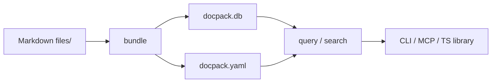
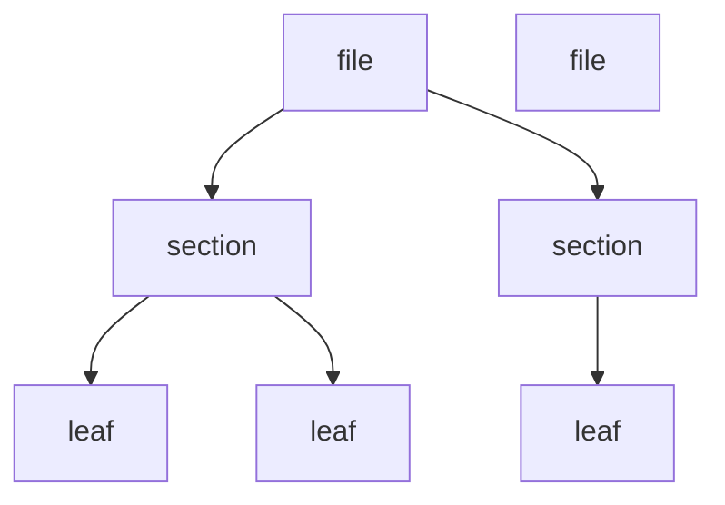

# docpack

Bundle a directory of Markdown files into a portable, queryable knowledge base.

```bash
docpack bundle --input ./docs --output ./mykb --home ./docs/toc.md
docpack toc ./mykb "getting-started" --depth 2
docpack search ./mykb "authentication AND OAuth" --limit 5
```

Single binary. CLI, TypeScript library, and MCP server.

## Quick start

```bash
# Bundle a directory of Markdown files
docpack bundle --input ./docs --output ./mykb --home ./docs/toc.md

# Explore the knowledge base
docpack manifest ./mykb
docpack toc ./mykb "toc" --depth 2
docpack search ./mykb "keyword" --limit 10

# Start an MCP server
docpack serve ./mykb --mcp
```

## Requirements

- **Node.js >= 20**
- **better-sqlite3** -- native module. Prebuilt binaries are downloaded automatically for common platforms.

## Usage

**From CLI**

```bash
npx @rlemaigre/docpack manifest ./mykb
```

**Or install**

```bash
npm install @rlemaigre/docpack
docpack manifest ./mykb
```

**From TypeScript**

```ts
import { bundle, query } from "@rlemaigre/docpack";
```

**As an AI Skill**

AI agents can install the query skill directly using:

```bash
npx skills add rlemaigre/docpack
```

## Output

Bundle command produces two files:

```
mykb/
  docpack.db        # SQLite knowledge base
  docpack.yaml      # human-readable manifest and entry points
```

## Input

The bundler reads files as **Markdown text (UTF-8)**. It recursively walks the input directory, parses ATX headings (`#` through `######`) to build a node hierarchy, and stores everything in SQLite with an FTS5 full-text index.

Conversion from other formats (PDF, DOCX, etc.) is the caller's responsibility — preprocess your files into Markdown before bundling.

## Cheat sheet

| Command                                    | Output | Use                                      |
| ------------------------------------------ | ------ | ---------------------------------------- |
| `manifest <kb>`                            | YAML   | KB metadata (version, home, stats)       |
| `toc <kb> <slug> --depth N`                | YAML   | Hierarchy with clipped subtree summaries |
| `get <kb> <slug>`                          | XML    | Node content + full subtree              |
| `search <kb> "query" --limit N --offset O` | YAML   | FTS5 search with BM25 ranking            |
| `serve <kb> --mcp`                         | stdio  | Long-lived MCP server for AI agents      |

## Architecture



The bundler walks the filesystem, reads each file as Markdown, parses headings into a node tree, and stores everything in SQLite with an FTS5 index. The query side reads from the same database.

### Node hierarchy



All ingested files are root nodes — directory structure is discarded. Two node types:

- **file** -- ingested Markdown document, root node, may contain sections
- **section** -- Markdown heading, child of a file, may contain subsections

Every `Node` has a `slug` (globally unique), `title`, `chunk` (self content), and `children`. Cross-file navigation uses `docpack://slug` links rewritten by the bundler.

## CLI reference

### bundle

```bash
docpack bundle --input <path> --output <path> --home <path>
```

| Option          | Required | Description                                              |
| --------------- | -------- | -------------------------------------------------------- |
| `--input`       | yes      | Directory of Markdown files to bundle                    |
| `--output`      | yes      | Output directory (creates `docpack.db` + `docpack.yaml`) |
| `--home`        | yes      | Path to the primary entry file (Markdown TOC)            |
| `--description` | no       | Human-readable description of the KB                     |
| `--url`         | no       | Source URL (wiki, website, etc.)                         |
| `--exported-at` | no       | Date of source data export (ISO 8601)                    |

Progress to stderr. Stats as JSON to stdout.

### manifest

```bash
docpack manifest <kb>
```

Returns YAML with version, aggregate statistics, and metadata (`home`, `description`, `url`, `exportedAt`). No file enumeration.

### toc

```bash
docpack toc <kb> <slug> [--depth <mode>]
```

| Depth mode   | Behavior                             |
| ------------ | ------------------------------------ |
| `N` (number) | Unfold N levels, clip with `Summary` |
| `full`       | Complete tree, no clipping           |

For clipped subtrees, children `Nodes` are replaced with a `Summary` object: `chunkCount`, `totalBytes`, `depth`, and optional summary `text`.

### get

```bash
docpack get <kb> <slug>
```

Returns XML with the node's chunk and its full subtree. Attributes include `slug`, `title`, `level`, `depth`, `parent`, `prev`, `next`.

### search

```bash
docpack search <kb> "query" [--limit N] [--offset O]
```

FTS5 full-text search over titles and chunk content. Query language supports:

- Plain words: `authentication`
- Phrases: `"DataWindow painter"`
- Boolean: `DataWindow AND painter`, `error OR warning`
- Negation: `DataWindow NOT painter`
- Prefix: `GetSeries*`
- Column-specific: `title:DataWindow`

Results ranked by BM25 score. `total` gives full result set size.

Embeddings and reranking : TBD (requires AI).

### summarize

```bash
docpack summarize <kb> --summaries <path>
docpack summarize <kb> --mode llm --model <name> --endpoint <url> --prompt <path>
```

Post-processing pass. Two modes:

**JSONL file mode** — import summaries from a JSONL file (one `{"slug":"...","summary":"..."}` per line):

```bash
docpack summarize ./mykb --summaries ./summaries.jsonl
```

**LLM fold mode** — built-in bottom-up tree fold with an OpenAI-compatible endpoint:

```bash
docpack summarize ./mykb \
  --mode llm \
  --model qwen3-8b \
  --endpoint http://localhost:8000/v1 \
  --prompt ./prompt.txt \
  --concurrency 32 \
  --min-content-length 200
```

Docpack traverses the node tree bottom-up, level by level. At each node it fills the prompt template with the node's content and its children's summaries, then sends a `POST /chat/completions` request. Parents always wait for all children to finish — siblings at the same depth are processed in parallel (bounded by `--concurrency`).

**Tree folding algorithm:**

1. Find all leaf nodes (no children). Process them in parallel.
2. Move up one level. For each parent, fill the prompt template with its chunk + children summaries. Process in parallel.
3. Repeat until the root is reached.

**Prompt template variables:**

| Variable | Description |
|---|---|
| `{title}` | Node's own title |
| `{slug}` | Node's own slug |
| `{chunk}` | Node's own content (Markdown). |
| `{children_titles}` | Ordered list of children titles, one per line |
| `{children_summaries}` | Ordered list of `title: summary` pairs, one per line |
| `{children_count}` | Number of children |

**Pass-through optimization (`--min-content-length`):**

If a leaf node has no chunk, or its chunk is shorter than `--min-content-length`, the LLM call is skipped. The chunk is used as-is if present, or the node is skipped. This avoids wasting LLM calls on trivial leaves and reduces hallucination risk on tiny inputs.

**Options:**

| Option | Required | Description |
|---|---|---|
| `--mode llm` | yes | Select LLM fold mode |
| `--model <name>` | yes | Model name sent to the endpoint |
| `--endpoint <url>` | yes | Base URL of an OpenAI-compatible server (e.g. `http://localhost:8000/v1`) |
| `--prompt <path>` | yes | Path to a prompt template file |
| `--concurrency <n>` | no | Max parallel LLM requests per level (default: 8) |
| `--min-content-length <n>` | no | Skip LLM call for leaf nodes shorter than this (default: 0 = disabled) |
| `--api-key <key>` | no | API key for cloud endpoints |

Works with any OpenAI-compatible endpoint: vLLM, Ollama, LM Studio, cloud OpenAI.

Both modes use upsert semantics — existing summaries for untouched slugs are preserved.

### serve

```bash
docpack serve <kb> --mcp
```

Starts an MCP server over stdio, exposing a knowledge base with four tools: `manifest`, `toc`, `get`, `search`.

## TypeScript API

### Bundle

```ts
import { bundle } from "@rlemaigre/docpack";

const stats = bundle({
  input: "./docs",
  output: "./mykb",
  home: "./docs/toc.md",
  description: "My project documentation",
  onProgress: (path, done, total) => console.log(`${done}/${total}`),
  onError: (path, err) => console.error(err),
});

console.log(stats);
// { filesProcessed: 10, totalChunks: 85, totalBytes: 133714 }
```

### Query

```ts
import { query } from "@rlemaigre/docpack";

const kb = query("./mykb");

// Discover entry point
const manifest = kb.manifest();
console.log(manifest.home); // "toc"

// Navigate with clipped summaries
const toc = kb.toc(manifest.home!, 2);

// Get full subtree
const doc = kb.get("api-auth");

// Search
const results = kb.search({
  query: "authentication AND OAuth",
  limit: 10,
  offset: 0,
});

kb.close();
```

### Summarize

**JSONL file mode** — import summaries from a JSONL file:

```ts
import { summarize } from "@rlemaigre/docpack";

await summarize({
  input: "./mykb",
  summaries: "./summaries.jsonl",  // one {"slug":"...","summary":"..."} per line
});
```

**LLM fold mode** — built-in bottom-up tree fold with an LLM endpoint:

```ts
await summarize({
  input: "./mykb",
  mode: "llm",
  model: "qwen3-8b",
  endpoint: "http://localhost:8000/v1",
  prompt: fs.readFileSync("./prompt.txt", "utf8"),
  concurrency: 32,
  minContentLength: 200,
});
```

Both modes use upsert semantics — existing summaries for untouched slugs are preserved.

## Data model

### Node

```
Node = {
  type: "file" | "section",
  title: string,
  slug: string,
  index: number,
  chunk: string?,      // self content (Markdown)
  summary: string?,    // subtree overview
  children: Node[] | Summary
}
```

### Summary

```
Summary = {
  chunkCount: number,   // descendants with content
  totalBytes: number,   // total chunk bytes in subtree
  depth: number,        // max depth below this node
  text?: string         // AI-generated overview
}
```

### XML output

```xml
<document slug="api-auth" title="Authentication" level="2" depth="0" parent="api" prev="api-overview" next="api-billing">
  <chunk>...</chunk>
  <children>
    <document slug="api-auth-oauth" title="OAuth" level="3" depth="0" parent="api-auth" prev="" next="api-auth-apikey">
      <chunk>...</chunk>
    </document>
  </children>
</document>
```

## Storage

SQLite with FTS5. Schema is an internal detail and may change.

- `nodes` -- node tree with slug, type, title, parent, chunk, summary
- `nodes_fts` -- FTS5 index on title and chunk
- `closure` -- materialized transitive closure for subtree queries

## Notes

- The bundler runs entirely synchronous -- no async, no streaming. Single SQLite transaction.
- Input files are read as Markdown (UTF-8). Conversion from other formats is the caller's responsibility.
- `toc()` is the primary discovery tool. Clipped subtrees carry `Summary` objects that let you aggregate overviews across branches without loading full content.
- `get()` returns the full subtree. Use `toc()` to find the slug you want, then `get()` to read it.
- `search()` bypasses the slug gate -- use it for keyword discovery when you don't know the structure.
- Summaries are optional post-processing. The bundler produces data; the summarizer produces overviews.
- The MCP server keeps the DB connection open across tool calls. Use it for multi-turn agent sessions.
