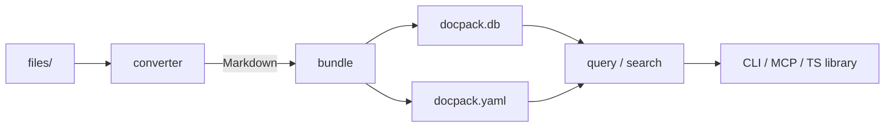
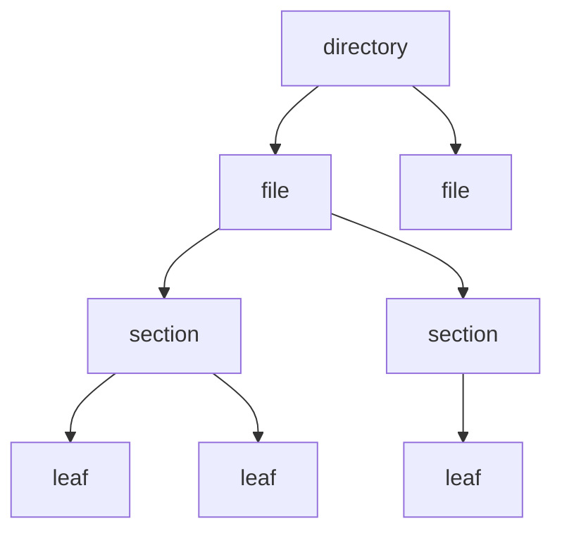

# docpack

Bundle any directory of documents into a portable, queryable knowledge base.

```bash
docpack bundle --input ./docs --output ./mykb --converter ./convert.ts
docpack toc ./mykb "getting-started" --depth 2
docpack search ./mykb "authentication AND OAuth" --limit 5
```

Single binary. CLI, TypeScript library, and MCP server.

## Quick start

```bash
# Bundle a directory of PDFs
docpack bundle --input ./docs --output ./mykb --converter ./convert.ts

# Explore the knowledge base
docpack manifest ./mykb
docpack toc ./mykb "my-root-slug" --depth 2
docpack search ./mykb "keyword" --limit 10

# Start an MCP server
docpack serve ./mykb --mcp
```

## Requirements

- **Node.js >= 20**
- **better-sqlite3** -- native module. Prebuilt binaries are downloaded automatically for common platforms.

## Usage

**From CLI**

```bash
npx @rlemaigre/docpack manifest ./mykb
```

**Or install**

```bash
npm install @rlemaigre/docpack
docpack manifest ./mykb
```

**From TypeScript**

```ts
import { bundle, query } from "@rlemaigre/docpack";
```

**As an AI Skill**

AI agents can install the query skill directly using:

```bash
npx skills add rlemaigre/docpack
```

## Output

Bundle command produces two files:

```
mykb/
  docpack.db        # SQLite knowledge base
  docpack.yaml      # human-readable manifest and entry points
```

## Cheat sheet

| Command                                    | Output | Use                                      |
| ------------------------------------------ | ------ | ---------------------------------------- |
| `manifest <kb>`                            | YAML   | KB overview, root slugs, file stats      |
| `toc <kb> <slug> --depth N`                | YAML   | Hierarchy with clipped subtree summaries |
| `get <kb> <slug>`                          | XML    | Node content + full subtree              |
| `search <kb> "query" --limit N --offset O` | YAML   | FTS5 search with BM25 ranking            |
| `serve <kb> --mcp`                         | stdio  | Long-lived MCP server for AI agents      |

## Architecture



The bundler walks the filesystem, delegates each file to a user-supplied converter, parses Markdown headings into a node tree, and stores everything in SQLite with an FTS5 index. The query side reads from the same database.

### Node hierarchy



Three input types, abstracted into a single `Node` primitive:

- **directory** -- filesystem folder, no self content
- **file** -- ingested source document, may contain sections
- **section** -- Markdown heading, may contain subsections

Every `Node` has a `slug` (globally unique), `title`, `chunk` (self content), and `children`.

## CLI reference

### bundle

```bash
docpack bundle --input <path> --output <path> --converter <path> [--include <glob>]
```

| Option        | Required | Description                                              |
| ------------- | -------- | -------------------------------------------------------- |
| `--input`     | yes      | File or directory to bundle                              |
| `--output`    | yes      | Output directory (creates `docpack.db` + `docpack.yaml`) |
| `--converter` | yes      | Script exporting a `Converter` function                  |
| `--include`   | no       | Glob pattern (default: `**/*`)                           |

Converter script:

```ts
import * as fs from "node:fs";

export default function converter(path: string): string | null {
  const ext = path.split(".").pop();
  if (ext === "md") return fs.readFileSync(path, "utf8");
  if (ext === "txt") return fs.readFileSync(path, "utf8");
  return null; // skip
}
```

Progress to stderr. Stats as JSON to stdout.

### manifest

```bash
docpack manifest <kb>
```

Returns YAML with version, statistics, root slugs, and file-level summaries.

### toc

```bash
docpack toc <kb> <slug> [--depth <mode>]
```

| Depth mode   | Behavior                             |
| ------------ | ------------------------------------ |
| `N` (number) | Unfold N levels, clip with `Summary` |
| `files`      | Expand to file boundaries            |
| `full`       | Complete tree, no clipping           |

For clipped subtrees, children `Nodes` are replaced with a `Summary` object : `chunkCount`, `totalBytes`, `depth`, and optional summary `text`.

### get

```bash
docpack get <kb> <slug>
```

Returns XML with the node's chunk and its full subtree. Attributes include `slug`, `title`, `level`, `depth`, `parent`, `prev`, `next`.

### search

```bash
docpack search <kb> "query" [--limit N] [--offset O]
```

FTS5 full-text search over titles and chunk content. Query language supports:

- Plain words: `authentication`
- Phrases: `"DataWindow painter"`
- Boolean: `DataWindow AND painter`, `error OR warning`
- Negation: `DataWindow NOT painter`
- Prefix: `GetSeries*`
- Column-specific: `title:DataWindow`

Results ranked by BM25 score. `total` gives full result set size.

Embeddings and reranking : TBD (requires AI).

### summarize

```bash
docpack summarize <kb> --fn <path>
```

Post-processing pass. The script receives a live KB instance and an `emit` callback:

```ts
export default async function (kb, emit) {
  const manifest = kb.manifest();
  for (const file of manifest.files) {
    const doc = kb.get(file.slug);
    const summary = await summarizeWithLLM(doc);
    emit(file.slug, summary);
  }
}
```

### serve

```bash
docpack serve <kb> --mcp
```

Starts an MCP server over stdio, exposing a knowledge base with four tools: `manifest`, `toc`, `get`, `search`.

## TypeScript API

### Bundle

```ts
import { bundle } from "@rlemaigre/docpack";

const stats = bundle({
  input: "./docs",
  output: "./mykb",
  converter: (path) => {
    // return Markdown string or null to skip
  },
  include: "**/*.md",
  onProgress: (path, done, total) => console.log(`${done}/${total}`),
  onError: (path, err) => console.error(err),
});

console.log(stats);
// { filesProcessed: 10, filesSkipped: 2, totalChunks: 85, totalBytes: 133714 }
```

### Query

```ts
import { query } from "@rlemaigre/docpack";

const kb = query("./mykb");

// Discover structure
const manifest = kb.manifest();
console.log(manifest.roots);
// ["getting-started", "api-reference"]

// Navigate with clipped summaries
const toc = kb.toc("api-reference", 2);

// Get full subtree
const doc = kb.get("api-auth");

// Search
const results = kb.search({
  query: "authentication AND OAuth",
  limit: 10,
  offset: 0,
});

kb.close();
```

### Summarize

```ts
import { summarize } from "@rlemaigre/docpack";

await summarize({
  input: "./mykb",
  async summarizer(kb, emit) {
    const manifest = kb.manifest();
    for (const file of manifest.files) {
      const doc = kb.get(file.slug);
      if (!doc) continue;
      const summary = await callLLM(doc);
      emit(file.slug, summary);
    }
  },
});
```

## Data model

### Node

```
Node = {
  type: "directory" | "file" | "section",
  title: string,
  slug: string,
  index: number,
  chunk: string?,      // self content (Markdown)
  summary: string?,    // subtree overview
  children: Node[] | Summary
}
```

### Summary

```
Summary = {
  chunkCount: number,   // descendants with content
  totalBytes: number,   // total chunk bytes in subtree
  depth: number,        // max depth below this node
  text?: string         // AI-generated overview
}
```

### XML output

```xml
<document slug="api-auth" title="Authentication" level="2" depth="0" parent="api" prev="api-overview" next="api-billing">
  <chunk>...</chunk>
  <children>
    <document slug="api-auth-oauth" title="OAuth" level="3" depth="0" parent="api-auth" prev="" next="api-auth-apikey">
      <chunk>...</chunk>
    </document>
  </children>
</document>
```

## Storage

SQLite with FTS5. Schema is an internal detail and may change.

- `nodes` -- node tree with slug, type, title, parent, chunk, summary
- `nodes_fts` -- FTS5 index on title and chunk
- `originals` -- gzipped source files for lossless re-bundling
- `closure` -- materialized transitive closure for subtree queries

## Notes

- The bundler runs entirely synchronous -- no async, no streaming. Single SQLite transaction.
- The converter handles file I/O, charset detection, and format parsing. The bundler knows nothing about file formats.
- `toc()` is the primary discovery tool. Clipped subtrees carry `Summary` objects that let you aggregate overviews across branches without loading full content.
- `get()` returns the full subtree. Use `toc()` to find the slug you want, then `get()` to read it.
- `search()` bypasses the slug gate -- use it for keyword discovery when you don't know the structure.
- Summaries are optional post-processing. The bundler produces data; the summarizer produces overviews.
- The MCP server keeps the DB connection open across tool calls. Use it for multi-turn agent sessions.
